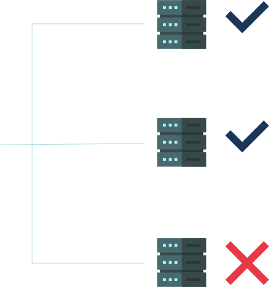

# api-monitor-master

<h3 align="center">API Monitor</h3>

A CLI program that help you check your endpoints by requesting the given servers and send a report message in any supported channel ( Telegram )

 

#### 
This is a CLI project that build with <a href="https://laravel-zero.com">Laravel Zero</a>

### Features